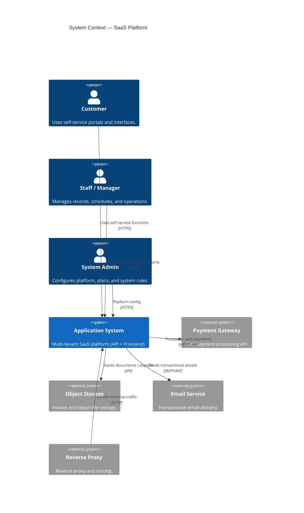
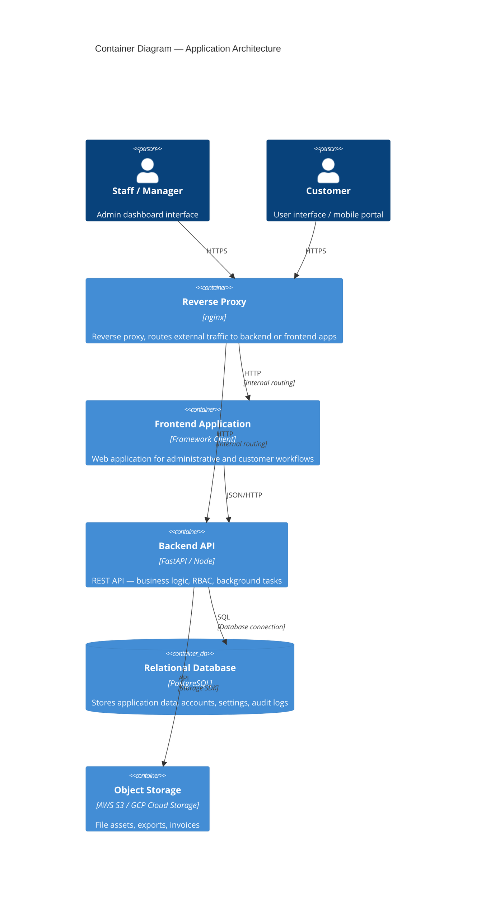
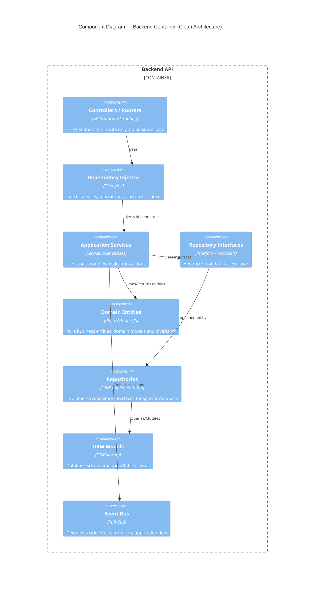

# C4 Architect Skill

## Overview
This skill enables the generation of comprehensive software architecture documentation following the **C4 model** (Context, Containers, Components, Code). It focuses on visualizing the system's static structure at different levels of abstraction using **Mermaid C4** syntax.

## Capabilities
1.  **Context Diagrams (Level 1)**: Visualize the system's interactions with users and external systems.
2.  **Container Diagrams (Level 2)**: Zoom in to show high-level technical building blocks (Web Apps, APIs, Databases).
3.  **Component Diagrams (Level 3)**: Decompose containers into logical components (Controllers, Services, Repositories).
4.  **Code Diagrams (Level 4)**: Represent UML class diagrams or entity relationships (ERD).

## Workflow

### Phase 1: Context Level (The "Big Picture")
**Goal**: Document who uses the system and what external systems it integrates with.
**Actions**:
- Identify all user personas: **Customer** (self-service portal), **Staff** (admin dashboard), **Manager** (reports), **System Admin** (platform config).
- Identify external systems: **Payment Gateway** (credit card processing), **Cloud Storage** (invoice/report storage), **Email Service** (transactional messaging), **Reverse Proxy** (load balancing/routing).
- Generate a `System Context Diagram` using `C4Context`.

### Phase 2: Container Level (High-Level Tech)
**Goal**: Show the deployable units and data flow.
**Actions**:
- Containers in scope: **Frontend Application** (web browser dashboard), **Mobile App** (user self-service), **Backend API** (port 8000), **Relational Database** (managed DB instance), **Object Storage** (media/exports), **Reverse Proxy** (SSL termination/routing).
- Document protocols: HTTPS (proxy → web frontend/API), JSON/HTTP (frontend → API), SQL/ORM (API → DB), API/SDK (API → Storage).
- Generate a `Container Diagram` using `C4Container`.

### Phase 3: Component Level (Internal Structure)
**Goal**: Show how the Backend API container is structured internally.
**Actions**:
- Analyse `src/` directory — layers of the system (e.g. Clean Architecture, Domain Driven Design).
- **Presentation**: routers, controllers, event listeners, templates.
- **Application**: use cases, services, DTOs, data access interfaces.
- **Domain**: pure business entities, value objects, domain rules.
- **Infrastructure**: database ORM implementations, third-party adapters (auth, payment).
- Generate a `Component Diagram` using `C4Component`.

## Mermaid Syntax Guide

### Context Diagram Example


### Container Diagram Example


### Component Diagram Example


## Instructions for Agent
When asked to perform architectural work:
1.  **Analyze**: Read the codebase to understand the current structure.
2.  **Plan**: Identify the level of detail required (Context -> Container -> Component).
3.  **Generate**: Create a markdown artifact (e.g., `docs/architecture/c4-context.md`) containing the Mermaid diagram and supporting text.
4.  **Verify**: Ensure the diagram accurately reflects the code.

## Output Templates

### Context Document Template
```markdown
# System Context

## Overview
[Description of the system]

## Personas
- **[Name]**: [Description]

## External Systems
- **[Name]**: [Description]

## Diagram
[Insert Mermaid C4Context]
```
