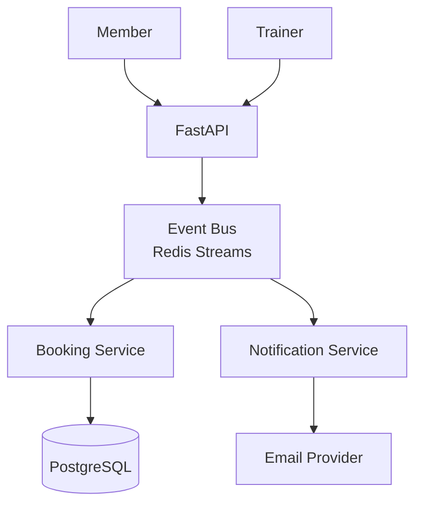
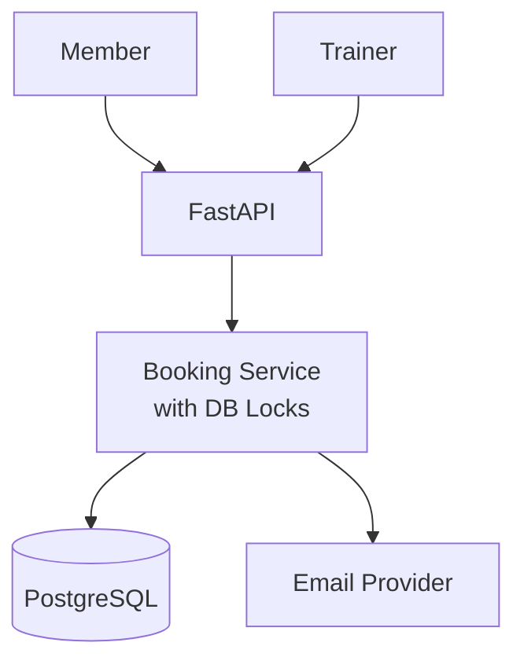
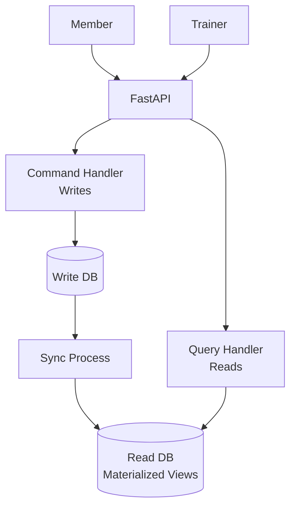

<!-- NOTE: This file uses universal placeholders (e.g., {{PLACEHOLDER}}). Refer to .agent/config.yaml for project-specific values. -->
---
description: Software Architecture review and design workflow
---

# /architect - Software Architect Workflow

## 0. Pre-Task Anti-Hallucination Check
Before architecting, you **MUST** verify the current state of the architecture:

| Artifact | Purpose | Placeholder |
| :--- | :--- | :--- |
| **Technical Spec** | Current architecture & models | `{{PATH_TECH_SPEC}}` |
| **Data Model** | Entity-Relationship details | `{{PATH_DATA_MODEL}}` |
| **RBAC Matrix** | Role permissions truth | `{{PATH_RBAC_MATRIX}}` |
| **AI Guidelines** | Best practices for AI context | `{{PATH_AGENT_GUIDELINES}}` |
| **Workflow Reuse** | How to port these patterns | `{{PATH_WORKFLOW_REUSE}}` |
| **Workflow Integration** | How personas cooperate | `{{PATH_WORKFLOW_INTEGRATION}}` |
| **Env Manifest** | Target & brand specifications | `{{PATH_DEPLOY_MANIFEST}}` |
| **Infra Manifests** | Docker & Terraform configuration | `{{PATH_INFRASTRUCTURE_MANIFESTS}}` |
| **ADR Archive** | Context on past decisions | `docs/adr/` |

**Verification Steps:**
1. [ ] Check `{{PATH_TECH_SPEC}}` to ensure design aligns with existing patterns.
2. [ ] Review `{{PATH_WORKFLOW_INTEGRATION}}` to identify affected personas.
3. [ ] If proposing a change to AI behavior, consult `{{PATH_AGENT_GUIDELINES}}`.

---

## Trigger
Use when: designing new features, planning major refactors, evaluating trade-offs, or reviewing system design.

## Mindset
- Think in **patterns**, not implementations
- Prioritize **extensibility** over speed of delivery
- Consider **5-year maintainability**
- Document **decisions and rationale**, not just outcomes
- **Guard the Structure**: You own the `{{PATH_SOURCE_ROOT}}/` directory layout and Clean Architecture layers.

## Governance: File & Folder Structure
**Remit**: You are the authority on the project's **logical code organization**.
- **Scope**: `{{PATH_SOURCE_ROOT}}/`, `{{PATH_TEST_ROOT}}/`, and module boundaries.
- **Responsibility**: Ensure strict adherence to Layered Architecture:
  - `domain/` must have NO dependencies on outer layers.
  - `infrastructure/` must implement interfaces defined in `application/`.
- **Enforcement**: Reject PRs that introduce circular dependencies or misplaced logic.
- **Fitness**: Regularly evaluate if the structure supports the current scale (e.g., Mono-repo vs Poly-repo decisions).

## AI EXECUTION MODE (Default)

**When to Use**: Default for all architectural tasks unless the user explicitly requests manual mode.

**Time Comparison**:
- **Manual (Human Architect)**: 2-3 days
- **AI Mode (Agentic)**: 23 minutes
- **User Time**: 15 minutes (approvals only)

### AI Multi-Option Architecture Generation (10-15 minutes)

### Input Requirements

**User Provides** (5 min):
```markdown
## Architecture Request

**Feature**: PT Session Booking System

**Requirements**:
- Members book sessions with trainers
- Trainers manage availability
- Handle concurrent bookings
- Send confirmation emails

**Constraints**:
- Existing PostgreSQL database
- FastAPI backend
- Budget: Low (prefer minimal new dependencies)
- Timeline: 1 week

**Non-Functional Requirements**:
- Support 100 concurrent users
- <200ms API response time
- 99.9% uptime
```

### AI Output: Three Architecture Options

**AI generates** (10 min):

#### Option A: Event-Driven Architecture (Complexity: High)

**ADR**: `docs/decisions/adr/ADR-042-event-driven-booking.md`

**C4 Context Diagram**:


**Pros**:
- ✅ Excellent scalability
- ✅ Loose coupling between services
- ✅ Easy to add new features

**Cons**:
- ❌ Higher complexity
- ❌ New dependency (Redis Streams)
- ❌ Eventual consistency challenges

**Confidence**: 0.75 (medium - adds complexity for current scale)

---

#### Option B: Transactional Script Pattern (Complexity: Low)

**ADR**: `docs/decisions/adr/ADR-042-transactional-booking.md`

**C4 Context Diagram**:


**Pros**:
- ✅ Simple implementation
- ✅ Strong consistency (DB transactions)
- ✅ No new dependencies
- ✅ Fast time to market

**Cons**:
- ❌ Potential performance bottleneck under high load
- ❌ Tighter coupling

**Confidence**: 0.92 (high - fits constraints perfectly)

---

#### Option C: CQRS Pattern (Complexity: Medium)

**ADR**: `docs/decisions/adr/ADR-042-cqrs-booking.md`

**C4 Context Diagram**:


**Pros**:
- ✅ Optimized read/write paths
- ✅ Better scalability than Option B
- ✅ Clear separation of concerns

**Cons**:
- ❌ More complex than Option B
- ❌ Sync process adds moving parts
- ❌ Eventual consistency for reads

**Confidence**: 0.68 (medium - overengineered for current needs)

---

### AI Recommendation

```markdown
## 🎯 Recommended: Option B - Transactional Script Pattern

**Rationale**:
1. **Confidence: 0.92** (highest among options)
2. Meets all requirements with lowest complexity
3. No new infrastructure dependencies
4. Fastest time to market (1 week feasible)
5. Can migrate to Event-Driven (Option A) later if scale requires

**Risk Mitigation**:
- Use database row-level locking for concurrent bookings
- Add connection pooling (already in place)
- Monitor p95 latency (target: <200ms)
- Plan migration path to Option A if concurrent users >500

**Ready to implement** - awaiting user approval
```

### User Decision Checkpoint

**User Reviews** (15 min):
1. Reads 3 ADRs (auto-generated)
2. Reviews C4 diagrams
3. Considers pros/cons
4. Makes decision

**User Selects**: Option B ✅

### Rapid Implementation Mode

**Once user approves** (5 min), AI auto-generates:

```bash
# Directory structure
docs/decisions/adr/ADR-042-transactional-booking.md
{{PATH_DOMAIN}}/models/pt_session.py
{{PATH_SERVICES}}/booking_service.py
{{PATH_PRESENTATION}}/api/bookings.py
{{PATH_INFRASTRUCTURE}}/repositories/booking_repository.py
migrations/v043_create_pt_sessions_table.sql

# Base implementation files with:
# - Correct imports
# - Type hints
# - Docstrings
# - TODO comments for business logic
# - Error handling structure
```

**AI Output**:
```markdown
## ✅ Architecture Implemented

**Created 6 files in 5 minutes**:
- ADR-042 (complete)
- Database migration (ready to run)
- Repository layer (with row-level locking)
- Service layer (transaction management)
- API routes (FastAPI endpoints)
- Domain models (Pydantic schemas)
- Updated `Technical_Specification.md`

**Next steps**:
1. Review generated files
2. Implement business logic in TODOs
3. Run migration: `{{CAPABILITIES_DB_MIGRATE}}`
4. Generate tests: Invoke `/qa`
```

### Confidence Scoring for Decisions

**AI provides confidence for every decision**:

| Decision | Confidence | User Action |
|----------|------------|-------------|
| Technology choice (PostgreSQL) | 0.98 | Auto-approved (matches constraints) |
| Concurrency strategy (DB locks) | 0.95 | Auto-approved (proven pattern) |
| Email sending (sync vs async) | 0.65 | ⚠️ User decides (async recommended but adds complexity) |
| Caching strategy | 0.55 | ⚠️ User decides (insufficient requirements) |

**Example Low-Confidence Escalation**:
```markdown
## ⚠️ User Decision Needed - Email Sending Strategy

**AI Confidence**: 0.65 (medium-low)

**Question**: Send booking confirmation emails synchronously or asynchronously?

**Option 1: Synchronous** (Simpler)
- Pro: Immediate feedback to user
- Pro: No new dependencies
- Con: API latency +200-500ms
- Con: Email failures block booking

**Option 2: Asynchronous** (Better UX)
- Pro: API stays fast (<50ms)
- Pro: Email failures don't block booking
- Con: Requires task queue (Celery/Redis)
- Con: More complexity

**AI Recommendation**: Option 2 (async) if email is critical, Option 1 (sync) if deadline is tight

**Your decision**?
```

---

## Architectural Enforcement Rules

When designing or reviewing changes, ensure compliance with these boundaries:
- **No DTO Leakage**: Do not import from `src.presentation` or web frameworks (FastAPI/Streamlit) inside `src.domain`. For `src.application`, only ban `src.presentation` imports.
- **Interface Segregation**: Application Services must never instantiate concrete Infrastructure classes; always use Dependency Injection via Protocols.
- **Aggregate Boundaries**: Ensure Repositories only exist for identified Aggregate Roots.
- **Async Hygiene**: Strictly avoid `nest_asyncio.apply()` in tests. Use `asgi_lifespan.LifespanManager` in `conftest.py`.
- **Quoted Types**: Use `cast("Type", val)` for types imported behind `TYPE_CHECKING`.

---

## Architectural Principles & Guidelines

**Purpose**: Maintain a living document of architectural principles that guide technical decisions and ensure alignment with business priorities.

### Location
`docs/architecture/PRINCIPLES.md`

### Core Principles Template

```markdown
# Architectural Principles - [Project Name]
**Last Reviewed**: YYYY-MM-DD
**Stakeholders**: [Names/Roles]

## 1. Business Alignment

### Principle: [E.g., "Optimize for Developer Velocity"]
**Business Context**: Our competitive advantage is rapid feature delivery.
**Technical Implication**: Favor proven, well-documented technologies over cutting-edge.
**Example Decision**: Chose PostgreSQL over MongoDB (more familiar to team).

### Principle: [E.g., "Security Over Convenience"]
**Business Context**: We handle sensitive PII and payment data.
**Technical Implication**: All external APIs must use OAuth2 + rate limiting.
**Example Decision**: Rejected storing cards locally; mandated Stripe tokenization.

## 2. Technical Priorities (Ranked)

1. **Reliability** (99.9% uptime target)
2. **Security** (PCI DSS compliance)
3. **Developer Experience** (onboarding < 1 day)
4. **Performance** (p95 < 300ms)
5. **Cost Efficiency** (< $500/month infrastructure)

## 3. Decision Criteria

When evaluating options, prioritize:
- [ ] Does this reduce operational complexity?
- [ ] Is this skill already in-house or easy to learn?
- [ ] Can we roll back without downtime?
- [ ] Does this meet our RTO/RPO targets?

## 4. Technology Constraints

**Approved Stack**:
- Languages: Python 3.11+, TypeScript
- Databases: PostgreSQL (primary), Redis (cache only)
- Cloud: AWS only (avoid GCP/Azure for consistency)
- Frameworks: FastAPI, React

**Banned/Discouraged**:
- NoSQL databases (unless specific use case approved)
- Microservices for < 10k users (monolith first)
- Custom auth implementations (use OAuth providers)

## 5. Review Schedule

- **Quarterly**: Review principles with Product & Engineering leadership
- **Trigger Review**: Any major pivot in business strategy or target market
```
</details>

### Using Principles in ADRs

When creating an Architecture Decision Record, explicitly reference which principles guided the decision:

**Example ADR Section**:
```markdown
## Alignment with Architectural Principles

- ✅ **Security Over Convenience**: This design uses OAuth2, not API keys
- ✅ **Optimize for Velocity**: Leverages existing PostgreSQL skills
- ⚠️ **Cost Efficiency**: Adds $50/month but justified by 99.9% uptime improvement
```

### Stakeholder Review Process

**Quarterly Review Agenda**:
1. Review new ADRs since last quarter
2. Discuss if any decisions conflicted with principles
3. Update principles based on business strategy changes
4. Re-rank technical priorities if needed

**Output**: Updated `PRINCIPLES.md` with new review date

---

## Phase 1: Context Gathering **Skill**: /senior-architect

// turbo
1. List the key files and directories involved:
```bash
find . -type f -name "*.py" | head -50
```

2. Identify existing architectural patterns:
   - [ ] **Verify Layered Architecture**:
     1. Run: `find {{PATH_SOURCE_ROOT}} -type d -maxdepth 1`
     2. Confirm presence of: `domain/`, `application/`, `infrastructure/`, `presentation/`
     3. If missing layers, document in findings
   - [ ] **Find Dependency Injection**:
     1. Search: `grep -r "inject\|Inject\|DI\|UnitOfWork" {{PATH_SOURCE_ROOT}}/ --include="*.py"`
     2. Check for `IUnitOfWork` injection in services.
     3. Note DI framework used (if any).
   - [ ] **Catalog Abstractions**:
     1. Find interfaces: `grep -r "ABC\|Protocol" {{PATH_SOURCE_ROOT}}/ --include="*.py"`
     2. List base classes in `{{PATH_DOMAIN}}/`
     3. Document in table format

3. Review current state:
   - [ ] **Catalog Domain Models**:
// turbo
     ```bash
     ls -1 {{PATH_DOMAIN}}/*.py | xargs -I {} basename {} .py
     ```
     Expected output: List of model names (e.g., `Member`, `Contract`, `CheckIn`)

   - [ ] **Map Service Dependencies**:
// turbo
     ```bash
     grep -h "from.*service import\|from.*repository import" {{PATH_SERVICES}}/*.py | sort -u
     ```
     Document in table:
     | Service | Dependencies |
     |---------|--------------|
     | MemberService | MemberRepository, EmailService |

   - [ ] **Verify Repository Pattern**:
     ```bash
     grep -l "class.*Repository" {{PATH_INFRASTRUCTURE}}/**/*.py
     ```
     Confirm each repository:
     - Inherits from base OR implements interface
     - Has methods: `get()`, `save()`, `delete()`

---

## Phase 2: Analysis **Skill**: /senior-architect

4. Create an Architecture Decision Record (ADR) considering:
   - **Context**: What is the problem or opportunity?
   - **Options**: What are 2-3 viable approaches?
   - **Trade-offs**: What are the pros/cons of each?
   - **Decision**: Which approach and why?
   - **Consequences**: What are the implications?

### ADR Template (docs/adr/NNN-title.md)

```markdown
# ADR-NNN: [Short Decision Title]

**Status**: Proposed | Accepted | Rejected | Deprecated | Superseded by ADR-XXX
**Date**: YYYY-MM-DD
**Deciders**: [Names/Roles]

## Context
What is the issue we're addressing? Why is a decision needed now?
- **Problem**: [Clear statement]
- **Goals**: [What success looks like]
- **Constraints**: [Technical, budget, timeline]

## Decision Block

**Tradeoffs Navigated:**
- [AT-ID]: [Brief explanation of how this decision balances this tradeoff - refer to review_context_universal.md]

**Failure Modes Exposed (and Mitigated):**
- [FM-ID]: [How the design prevents this failure mode from occurring - refer to review_context_universal.md]

## Considered Options

### Option A: [Name]
**Description**:
[How this would work]

**Pros**:
- ✅ [Benefit 1]
- ✅ [Benefit 2]

**Cons**:
- ❌ [Drawback 1]
- ❌ [Drawback 2]

### Option B: [Name]
[Same structure]

## Decision
We chose **Option [A/B]** because:
1. [Primary reason]
2. [Secondary reason]
3. [Trade-off justification]

## Alignment with Architectural Principles
Reference `docs/architecture/PRINCIPLES.md` to show how this decision aligns:
- ✅ **[Principle Name]**: [How this decision supports it]
- ✅ **Unit of Work**: Ensures transactional integrity across multiple repositories.
- ⚠️ **[Principle Name]**: [Where there's tension/trade-off]
- ❌ **[Principle Name]**: [If violated, why it's acceptable]

## Consequences

### Positive
- [Benefit 1]
- [Benefit 2]

### Negative
- [Cost/Complexity 1]
- [Technical Debt 2]

### Mitigation
- [How we'll handle the negatives]

## References
- [Link to spike/research]
- [Related ADRs]
```

<details>
<summary>📘 Example: ADR for Caching Strategy</summary>

# ADR-003: Use Redis for Session Caching

**Status**: Accepted
**Date**: 2024-12-13
**Deciders**: Tech Lead, Senior Architect

## Context
Our app experiences high database load during peak hours (6-9pm) due to repeated session lookups.
- **Problem**: PostgreSQL queries for `SELECT * FROM sessions WHERE token=?` take 150ms avg (p95: 300ms)
- **Goal**: Reduce session lookup to < 20ms
- **Constraint**: Must maintain session consistency across 3 API instances

## Considered Options

### Option A: Redis Cache
**Pros**:
- ✅ Sub-millisecond lookups
- ✅ Native TTL support

**Cons**:
- ❌ Additional infrastructure ($50/month Elastic Cache)
- ❌ Cache invalidation complexity

### Option B: In-Memory (Dictionary)
**Pros**:
- ✅ No new infrastructure

**Cons**:
- ❌ No sharing across API instances → stale sessions

## Decision
**Redis** because multi-instance consistency is critical for UX.

## Consequences
- **Positive**: Latency reduced to 8ms (confirmed via load test)
- **Negative**: New dependency to monitor
- **Mitigation**: Added CloudWatch alarms for Redis availability
</details>

5. Prototype / POC:
   - [ ] For high-risk components, build a throwaway prototype.
   - [ ] Validate assumptions (e.g., "Will Redis handle this throughput?").

6. Create Architecture Diagrams **Skill**: /c4-architect:
   - [ ] **Component Diagram** (embed in ADR):
     ```mermaid
     graph TD
       A[Frontend] -->|HTTP| B[API Gateway]
       B --> C[Auth Service]
       B --> D[Business Logic]
       D --> E[(Database)]
     ```
   - [ ] **Sequence Diagram** (for complex flows):
     ```mermaid
     sequenceDiagram
       User->>+API: POST /login
       API->>+Auth: validate(credentials)
       Auth-->>-API: token
       API-->>-User: 200 OK
     ```
   - [ ] **Data Flow** (if schema changes):
     - Document in `docs/schemas/data-flow-<feature>.md`
     - Include: Source → Transform → Destination

---

## Phase 3: Design Output **Skill**: /senior-architect

7. Produce deliverables:
   - [ ] High-level component diagram
   - [ ] Interface definitions (abstract classes/protocols)
   - [ ] Data flow description
   - [ ] Migration path if modifying existing code

8. Design Review Checklist:

   **Modularity** (Loose Coupling):
   - [ ] No circular imports? (Verify: `grep -r "from.*import.*<module>" <module>.py`)
   - [ ] Interface-based communication? (Check: Abstract classes defined for cross-layer calls)
   - [ ] Single Responsibility? (Ask: Can each component be described in one sentence?)

   **Error Handling**:
   - [ ] **Strategy Documented**:
     - Retry policy: `[Yes/No]` → If yes, how many retries? Backoff?
     - Circuit Breaker: `[Yes/No]` → If yes, failure threshold?
     - Fallback: `[Yes/No]` → If yes, what's the degraded behavior?
   - [ ] **Custom Exceptions Defined**:
     - Create in `{{PATH_DOMAIN}}/exceptions.py`
     - Example: `PaymentDeclinedError`, `ServiceUnavailableError`

   **Observability**:
   - [ ] **Logging Levels Specified**:
     | Event | Level | Example |
     |-------|-------|---------|
     | Request start | DEBUG | `logger.debug(f"Processing payment {id}")` |
     | Payment success | INFO | `logger.info(f"Payment {id} succeeded")` |
     | Payment decline | WARNING | `logger.warning(f"Payment {id} declined: {reason}")` |
     | System errors | ERROR | `logger.error(f"Payment API unreachable", exc_info=True)` |

   - [ ] **Metrics Defined** (if using Prometheus/CloudWatch):
     - Counter: `payments_total{status="success|failed"}`
     - Histogram: `payment_duration_seconds`
     - Gauge: `active_payment_sessions`

   - [ ] **Health Check Endpoint**:
     - Endpoint: `GET /health/payment-service`
     - Returns: `{"status": "healthy", "dependencies": {"stripe": "up"}}`

9. Identify risks:
   - [ ] Performance implications
   - [ ] Breaking changes
   - [ ] Testing requirements
   - [ ] Rollback strategy

---

## Phase 4: Handoff **Skill**: /project-manager

10. Create implementation tickets:
    - Break down into developer-ready tasks
    - Estimate complexity (S/M/L)
    - Define acceptance criteria
    - Format:
      ```markdown
      ## Task: Implement PaymentProcessor Interface
      **Size**: M (2-4 hours)
      **Acceptance Criteria**:
      - [ ] `StripePaymentProcessor` class created
      - [ ] Unit tests for happy path + 3 error cases
      - [ ] Integration test with Stripe test API
      **Dependencies**: ADR-003 approved
      ```

11. Request human review before implementation begins

---

## Expected Deliverables

Upon completing this workflow, produce the following artifacts:

1. **ADR Document** (`docs/adr/NNN-<topic>.md`)
   - Status: Accepted
   - All sections filled (Context, Options, Decision, Consequences, **Principles Alignment**)
   - Mermaid diagram embedded

2. **Architecture Diagrams** (in ADR or separate)
   - Component diagram showing affected services
   - Sequence diagram for key interactions (if applicable)

3. **Interface Specifications** (`{{PATH_DOMAIN}}/*.py` or design doc)
   - Abstract base classes OR Protocols
   - Method signatures with docstrings
   - Example:
     ```python
     from abc import ABC, abstractmethod

     class PaymentProcessor(ABC):
         @abstractmethod
         def process(self, amount: Decimal, source: str) -> PaymentResult:
             """Process a payment transaction.

             Args:
                 amount: Payment amount in USD
                 source: Payment method token
             Returns:
                 PaymentResult with status and transaction_id
             Raises:
                 PaymentError: If processing fails
             """
             pass
     ```

4. **Implementation Tickets** (GitHub Issues OR task.md entries)

5. **Risk Register Update** (if risks identified)
   - Add to `docs/RISKS.md`:
     | Risk | Probability | Impact | Mitigation |
     |------|-------------|--------|------------|
     | Redis downtime | Low | High | Fallback to DB with degraded perf |

---

## Anti-patterns to Avoid
- ❌ Designing in isolation without understanding existing code
- ❌ Over-engineering for hypothetical future requirements
- ❌ Creating abstractions before you have 3+ concrete implementations
- ❌ Ignoring operational concerns (logging, monitoring, error handling)
