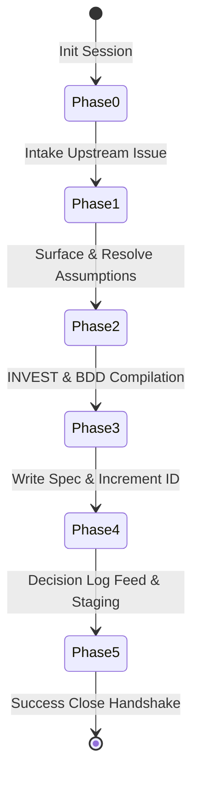

# Business Analyst Workflow (/ba)

This workflow defines the process of capturing user requirements, exposing unstated assumptions, drafting concrete acceptance criteria, and producing high-quality, AI-ready specifications (`SPEC-XXX.md`).

---

## Workflow Boundary & Handoffs

- **Governance Role**: The `/ba` workflow is the authoritative source for "what to build and why."
- **Scope Boundary with T1-L-03**: Effort estimation, task breakdown, and sprint planning are explicitly out of scope for `/ba` and belong to the `/project-manager` workflow (`T1-L-03`). The specification template contains no backlog or estimation sections.
- **Human in the Loop**: The agent *drafts* the specification; the human architect must *approve* it by setting `**Status**: APPROVED` prior to implementation. When a spec is moved to `docs/planning/specs/archive/`, its `Status` field must be updated to `DELIVERED` in the same commit.

---

## State Machine Phases



### Phase 0: Session Initialization
1. Execute the session startup command to establish session traceability and token budget boundaries:
   ```bash
   python .agent/scripts/init_session.py
   ```
2. Read `outer_loop.mode` from `.agent/config.yaml` (default: `incremental` if absent):
   ```python
   # Quick inline check — no separate script required
   import re
   content = open(".agent/config.yaml").read()
   m = re.search(r"outer_loop:\s*\n\s*mode:\s*(\w+)", content)
   mode = m.group(1) if m else "incremental"
   print(f"📋 /ba workflow — outer_loop.mode: {mode}")
   ```
   The mode governs enforcement levels throughout this session:
   - `discovery` — assumption resolution is advisory; `[Pending]` items do not block APPROVED
   - `incremental` — current default behaviour; `[Pending]` items block APPROVED
   - `contractual` — strictest enforcement; all assumptions must carry explicit `[Resolved: ...]` text

### Phase 1: Upstream Issue Intake
1. Identify the source requirement (GitHub Issue, Jira Ticket, Linear URL, or local conversation file).
2. Record the upstream issue reference on the first line of the spec under `**Source Issue**:`. 
3. *Institutional Guard*: Treat raw issue text as active starting material. Do not manufacture requirements out of thin air.

### Phase 2: Explicit Assumption Surfacing
1. Prior to compiling acceptance criteria, prompt the LLM to enumerate every assumption it is making that is not explicitly stated in the source issue.
2. For each surfaced assumption, assign a confidence level (HIGH / MEDIUM / LOW).
3. Resolve each surfaced assumption in one of three ways:
   - **Promoted** to an explicit acceptance criterion (`[Resolved: promoted to criterion #X]`).
   - **Declared out of scope** in the bounded scope section (`[Resolved: declared out of scope]`).
   - **Flagged** for human clarification (`[Pending: human review]`).
4. Write all resolved and pending assumptions into the `# Assumptions` section. Ensure that each non-empty line starts with `[Resolved` or `[Pending` (case-insensitive).

**Mode-conditional behaviour for `[Pending]` assumptions**:

| Mode | Requirement | `[Pending]` blocks APPROVED? |
|---|---|---|
| `discovery` | Enumerate assumptions and capture known unknowns. `[Pending]` items are noted but do not block. Print advisory: *"Discovery mode: pending assumptions noted but not blocking."* | No |
| `incremental` | Any assumption with confidence below HIGH must be marked `[Pending: human review]`. The human architect resolves it before APPROVED can be set. | Yes |
| `contractual` | Stricter than incremental. MEDIUM confidence assumptions must also be explicitly resolved, not just noted. Every assumption bullet must carry `[Resolved: explicit reason]` — a bare `[Resolved]` marker is not sufficient. The human architect must supply the resolution text. | Yes (no bare markers) |

### Phase 3: INVEST Stories & Gherkin BDD
1. Structure requirements as user stories satisfying the INVEST criteria (Independent, Negotiable, Valuable, Estimable, Small, Testable).
2. Translate all functional requirements into concrete, testable Gherkin scenarios in `# Acceptance Criteria`.
3. *BDD Quality Check*: Each scenario must strictly contain at least one occurrence of **each** of the three essential keywords: `Given`, `When`, and `Then` using word-boundary matching.

### Phase 4: Spec Compilation & Auto-Incrementing Spec ID
1. Automatically determine the next Specification ID:
   - Scan `docs/planning/specs/` for files matching the pattern `SPEC-\d+\.md`.
   - Take the highest number, increment it by one (e.g. `SPEC-001` $\rightarrow$ `SPEC-002`), and use it. If no specifications exist, start at `SPEC-001`.
2. Render the specification file to `docs/planning/specs/SPEC-XXX.md` using the `.agent/templates/feature_spec.md` template.
3. Include a one-line metadata comment at the very top of the spec file recording the active mode at authoring time:
   ```
   <!-- outer_loop.mode: {mode} at time of authoring -->
   ```
   This creates a permanent record of which methodology the spec was written under, which is useful if the project's mode changes later.

### Phase 5: Architectural Traceability Feed
1. On session close, identify all architectural and design decisions captured within the spec.
2. **Decisions log archival check**: Before writing new decisions, count the lines in `.agent/state/decisions_log.md`. If the file exceeds **150 lines**, prompt the developer to archive the oldest entries to `.agent/state/decisions_log_archive.md` before proceeding — the review gate injects the full `decisions_log.md` into every review context, and an oversized log degrades review quality.
3. Feed these decisions directly into `.agent/state/decisions_log.md` using the exact three-bullet markdown schema expected by the review gate:
   ```markdown
   ## YYYY-MM-DD: [SPEC-XXX] [Decision Title]
   - **Decision**: [The choice/pattern selected]
   - **Context**: [The requirements/constraints from SPEC-XXX]
   - **Consequence**: [How it affects development layers/testing]
   ```

---

## Staging & Committing Conventions

To maintain strict workspace hygiene and prevent session state or lock file leakage:

1. **Named Staging Targets Only**: Only stage the compiled specification and the updated decisions log. Never use wildcard commands (such as `git add .` or `git add -A`).
   ```bash
   git add docs/planning/specs/SPEC-XXX.md .agent/state/decisions_log.md
   ```
2. **Conventional Commit Formatting**: Commit messages must follow the conventional commit specification:
   ```
   spec(governance): compile specification SPEC-XXX [Source Issue URL]
   ```

---

## Session Outcome Override Handshake

Because planning-only sessions (spec creation) do not involve source code commits, `init_session.py` will automatically treat them as "abandoned" if not closed properly. To perform the close handshake:
1. Update `.agent/state/session.json` by writing a structured outcome override before exiting:
   ```json
   "outcome_override": "success",
   "outcome_override_source": "business_analyst",
   "outcome_override_note": "Specification SPEC-XXX compiled with no active code changes."
   ```
   *(This ensures that planning-only sessions are logged in the session ledger as a successful delivery).*
