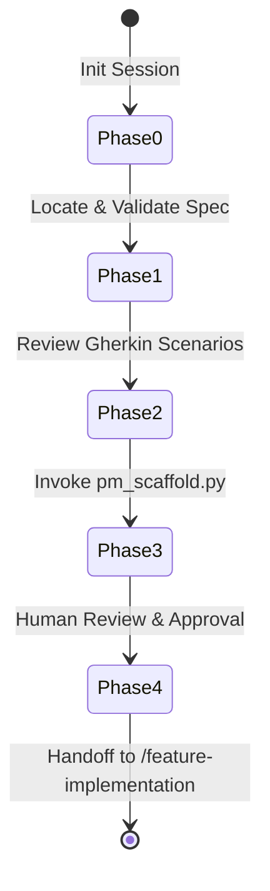

# Project Manager Workflow (/pm)

This workflow defines the process of sprint planning, task estimation, dependency analysis, and scaffolding a development backlog (`SPEC-XXX-tasks.md`) from approved requirements specifications (`SPEC-XXX.md`).

---

## Workflow Boundary & Handoffs

- **Governance Role**: The `/pm` workflow is the authoritative source for "how to build and estimate the task backlog."
- **Predecessor**: Receives an `APPROVED` specification file `docs/planning/specs/SPEC-XXX.md` from the `/ba` workflow. The `/pm` workflow will not proceed if the specification status is not `APPROVED` (checked in Phase 1).
- **Output**: A populated `task.md` format backlog file written to `docs/planning/tasks/SPEC-XXX-tasks.md`.
- **Successor**: Hands off the scaffolded task backlog to the `/feature-implementation` workflow.

---

## State Machine Phases



### Phase 0: Session Initialization
1. Execute the session startup command to establish session traceability and token budget boundaries:
   ```bash
   python .agent/scripts/init_session.py
   ```
2. Confirm the active mode configuration `outer_loop.mode` from `.agent/config.yaml` is respected:
   - `discovery` — prose specs are valid; fallback to prose estimation if Gherkin is missing.
   - `incremental` — current default behavior; Gherkin scenarios are parsed and mapped to tasks.
   - `contractual` — strict enforcement; `--offline` is disabled unless budget provider is unavailable.

### Phase 1: Locate & Validate Specification
1. Resolve the `SPEC-XXX` ID dynamically (CLI argument, environment variable, or git branch name).
2. Locate the spec file using the `specs_path` from `.agent/config.yaml` (default: `docs/planning/specs/SPEC-XXX.md`).
3. Verify that the specification header states `Status: APPROVED`. If it is in `DRAFT` status or absent, stop and report the validation failure.

### Phase 2: Review Acceptance Criteria
1. Scan `# Acceptance Criteria` in `SPEC-XXX.md` and count the Gherkin scenarios (lines beginning with `Scenario:` or `Scenario \d+:`).
2. Report the scenario count to the developer: `"N scenarios found. About to scaffold task backlog."`

### Phase 3: Invoke Scaffolder
1. Run the scaffolding utility to build the task list:
   ```bash
   python .agent/scripts/pm_scaffold.py SPEC-XXX
   ```
2. If `docs/planning/tasks/SPEC-XXX-tasks.md` already exists, a backup file `{output_path}.bak` is created. If completed checkboxes (`[x]`) are detected, request human confirmation before overwriting.

### Phase 4: Human Review & Handoff
1. Display the scaffolded task backlog at `docs/planning/tasks/SPEC-XXX-tasks.md`.
2. Allow the developer to review and adjust estimates or add custom tasks/dependencies.
3. Hand off the finalized task checklist to `/feature-implementation`.

---

## Staging & Committing Conventions

To maintain strict workspace hygiene:

1. **Named Staging Targets Only**: Only stage the compiled task backlog. Do not use wildcard commands (such as `git add .` or `git add -A`).
   ```bash
   git add docs/planning/tasks/SPEC-XXX-tasks.md
   ```
2. **Conventional Commit Formatting**: Commit messages must follow the conventional commit specification:
   ```
   plan(SPEC-XXX): scaffold task backlog — N tasks, M points estimated
   ```

---

## Session Outcome Override Handshake

Planning-only sessions must write a success outcome override to `.agent/state/session.json` prior to close:
```json
"outcome_override": "success",
"outcome_override_source": "project_manager",
"outcome_override_note": "Sprint backlog SPEC-XXX scaffolded with no active code changes."
```
