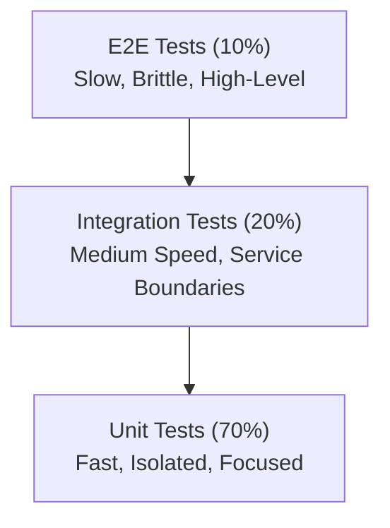

<!-- NOTE: This file uses universal placeholders (e.g., {{PLACEHOLDER}}). Refer to .agent/config.yaml for project-specific values. -->
---
description: Test planning, execution, and quality assurance
---

# /qa - Test Engineer Workflow

## Trigger
Use when: writing tests, hunting bugs, validating features, or ensuring quality gates.

## Mindset
- **Adversarial thinking** - try to break things
- **Edge cases first** - happy paths are boring
- **Regression prevention** - every bug fixed needs a test
- **Confidence, not coverage** - 80% meaningful > 100% trivial
- **Pipeline Integration**: You MUST ensure tests are ready for consumption by `{{PATH_CICD_SPEC}}` smoke test stages.
- **Traceability Authority**: You own the `{{PATH_RTM}}` and must ensure every requirement has a test.

---

## AI EXECUTION MODE (Default)

**When to Use**: Default for all test planning, writing, and validation tasks unless the user explicitly requests manual mode.

**Time Comparison**:
- **Manual (Human)**: 1 day
- **AI Generated**: 22 min
- **User Time**: 8 min (review only)

### Auto-Generation from BDD Scenarios

**Input**: BDD scenarios from `/business-analyst`

```gherkin
# Example: bdd/features/checkin.feature
Feature: Member Check-in
  Scenario: Valid member checks in
    Given a member with ID 1 has an active contract
    When the member checks in
    Then the check-in is recorded
    And the check-in count increases by 1
```

**AI Output** (Parallel, 10 min total):

1. **Unit Tests** (`{{TECH_STACK_TEST_FRAMEWORK}}` with fixtures):
```python
# {{PATH_TEST_ROOT}}/unit/test_checkin_service.py
def test_checkin_active_member_succeeds(member_factory, contract_factory):
    # Arrange: AI infers from BDD "Given"
    member = member_factory(status="active")
    contract = contract_factory(member_id=member.id, end_date=tomorrow())

    # Act: AI infers from BDD "When"
    result = perform_checkin(member.id)

    # Assert: AI infers from BDD "Then"
    assert result.success is True
    assert result.checkin_id is not None
```

2. **Integration Tests** (API endpoints):
```python
# {{PATH_TEST_ROOT}}/integration/test_checkin_api.py
def test_post_checkin_active_member_returns_201(test_client, db_session):
    # AI automatically tests full API stack
    response = test_client.post("/api/checkins", json={"member_id": 1})
    assert response.status_code == 201
    assert db_session.query(Checkin).filter_by(member_id=1).count() == 1
```

3. **E2E Tests** (Playwright, critical user journeys only):
```python
# {{PATH_TEST_ROOT}}/e2e/test_kiosk_checkin.py
def test_kiosk_checkin_flow(page):
    # AI identifies this as critical E2E path
    page.goto("{{URL_APP_LOCAL}}")
    page.fill("#member_id", "1")
    page.click("button:has-text('Check In')")
    expect(page.locator(".success-message")).to_be_visible()
```

4. **Edge Case Tests** (AI infers from boundaries):
```python
def test_checkin_expired_contract_fails(member_factory, contract_factory):
    member = member_factory()
    contract = contract_factory(member_id=member.id, end_date=yesterday())

    with pytest.raises(ContractExpiredError):
        perform_checkin(member.id)
```

### Confidence Scoring & Auto-Approval

**AI assigns confidence to each generated test**:

| Confidence | Meaning | Action |
|------------|---------|--------|
| 0.9-1.0 | High | Auto-commit to codebase |
| 0.7-0.8 | Medium | User review optional |
| 0.5-0.6 | Low | User review required |
| <0.5 | Very low | Flag for user to write manually |

**Example AI Output**:
```markdown
## Test Generation Results

**Unit Tests**: 45 generated (Confidence: 0.95) ✅ Auto-committed
**Integration Tests**: 12 generated (Confidence: 0.92) ✅ Auto-committed
**E2E Tests**: 3 generated (Confidence: 0.88) ✅ Auto-committed
**Edge Cases**: 8 generated (Confidence: 0.65) ⚠️ User review recommended

**Coverage**: 87% (target: ≥80%) ✅
**Mutation Score**: 76% (target: ≥80%) ⚠️ Need to strengthen 3 tests
```

### Auto-Remediation for Quality Gates

**Coverage <80%** (AI auto-fixes):
1. AI identifies uncovered lines
2. AI generates tests for those lines
3. Re-runs coverage
4. Repeats until ≥80% or 2 iterations
5. If still <80%: Escalates to user

**Mutation Score <80%** (AI auto-fixes):
1. AI runs `mutmut`
2. Identifies survived mutants
3. Strengthens test assertions
4. Re-runs mutation testing
5. If still <80% after 2 iterations: Escalates to user

**Example Auto-Remediation**:
```markdown
## Auto-Remediation Report

**Iteration 1**:
- Coverage: 76% → Generated 8 tests → 82% ✅
- Mutation Score: 73% → Strengthened 5 assertions → 78%

**Iteration 2**:
- Mutation Score: 78% → Strengthened 3 more assertions → 81% ✅

**Final Results**:
- Coverage: 82% ✅
- Mutation Score: 81% ✅
- Mutation Score: 81% ✅
- All quality gates passed without user intervention

### Test-Driven Repair Loop (Autonomous)
> [!TIP]
> Use this loop when tests fail during implementation.

1. **Analyze Failure**: Read the traceback.
2. **Locate Code**: Find the exact file and line number.
3. **Hypothesize Fix**: Determine if logic or test is wrong.
4. **Apply Fix**: Edit code (max 3 files).
5. **Verify**: Run `{{CAPABILITIES_TEST_RUN_ALL}} <test_file>` immediately.
6. **Retry**: If fail, repeat up to 3 times.
```

### User Intervention Points

**Always Require User Review**:
1. **Domain-Specific Edge Cases** (confidence <0.7):
   ```markdown
   ## ⚠️ User Review Needed - Low Confidence Edge Cases

   **AI generated these tests but isn't confident about domain logic**:

   1. `test_checkin_concurrent_same_member` (Confidence: 0.55)
      - Question: Should system allow/prevent concurrent check-ins?
      - Current: AI assumes prevent (only 1 check-in per member active)

   2. `test_checkin_during_contract_grace_period` (Confidence: 0.45)
      - Question: Is there a grace period after contract expires?
      - Current: AI assumes no grace period

   **Action**: Review and approve/modify these tests
   ```

2. **Test Failures After Generation** (AI can't auto-fix):
   ```markdown
   ## ⚠️ Generated Tests Failing

   **3 tests failing after generation**:
   - `test_checkin_expired_contract_fails` - Feature not implemented yet
   - `test_checkin_suspended_member_fails` - Missing status='suspended' logic

   **Options**:
   1. Implement missing features
   2. Mark tests as @pytest.mark.skip(reason="Feature pending")
   3. Remove tests (not recommended)
   ```

**Never Require User Review** (AI handles):
- Test generation from clear BDD scenarios (confidence >0.9)
- Coverage gap remediation
- Code formatting ({{TECH_STACK_FORMATTER}})
- Simple fixture creation

---

## 0. Pre-Task Anti-Hallucination Check (MANDATORY)

**CRITICAL**: Before starting any testing or QA work, you MUST ensure fresh context from the testing guides and pipeline specifications.

### Required Review Files:

| File | Purpose | Max Age | Action if Stale |
|------|---------|---------|-----------------|
| `docs/testing/TESTING_GUIDE.md` | Core testing patterns and examples | 7 days | Re-read relevant test types |
| `{{PATH_CICD_SPEC}}` | Pipeline quality gates and smoke test requirements | 14 days | Re-read Stage 5.3 & 5.4 |
| `{{PATH_RTM}}` | Traceability between requirements and tests | Current Task | Audit relevant FR/NFR rows |
| `{{PATH_TECH_SPEC}}` | Development standards & UI architecture | 14 days | Re-read Section 7 |
| `.agent/state/last_session_summary.md` | Recent changes | Current session | Always read at session start |

### Review Checklist

Before implementing or running tests:

- [ ] **Read `docs/testing/TESTING_GUIDE.md`** - Refresh on BDD and Integration patterns
- [ ] **Review `{{PATH_CICD_SPEC}}`** - Confirm smoke test targets and CI gate thresholds
- [ ] **Audit `{{PATH_RTM}}`** - Identify which requirements lack coverage for this task
- [ ] **Document review date** - Add comment: "Reviewed QA operational docs: [DATE]"

---

## Phase 1: Test Planning **Skill**: /test-writing

1. Analyze the feature/change:
   - [ ] What is the expected behavior?
   - [ ] What are the inputs and outputs?
   - [ ] What are the dependencies?

2. Test Data Strategy:
   - [ ] Use factories (e.g., `factory_boy`) for reproducible data.
   - [ ] **Avoid using production dumps** without sanitization.

2. **Test Pyramid Distribution**:

Follow the test pyramid to balance speed, reliability, and coverage:



**Distribution Guidelines**:
| Test Level | Percentage | Execution Time | Focus | Example |
|------------|------------|----------------|-------|---------|
| **Unit** | 70% | < 100ms | Functions, classes | Test `calculate_membership_fee()` returns correct amount |
| **Integration** | 20% | < 1s | API, DB, services | Test `POST /api/members` creates member in database |
| **E2E** | 10% | < 10s | Critical user flows | Test complete check-in journey from UI to database |

**Unit Test Criteria**:
- Test single function/method in isolation
- Mock all external dependencies (DB, APIs, file system)
- Fast execution (< 100ms each)
- No network I/O, no database access
- Example: Testing business logic in `{{PATH_DOMAIN}}/services.py`

**Integration Test Criteria**:
- Test interaction between components
- Use real database (test DB, not mocked)
- Test API endpoints end-to-to-end
- Example: Testing `POST /api/members` creates record in `{{TECH_STACK_DB_ENGINE}}`

**E2E Test Criteria**:
- Test critical user journeys only (3-5 max)
- Use browser automation ({{TECH_STACK_UI_TEST_TOOL}})
- Test complete workflows: Login → Action → Verification
- Example: Member check-in flow from kiosk UI to database update

**Test Budget Example** (500 total tests):
- Unit tests: 350 (70%)
- Integration tests: 100 (20%)
- E2E tests: 50 (10%)

3. Define test scenarios:

| Scenario | Type | Priority | Input | Expected Output |
|----------|------|----------|-------|--------------------|
| Valid check-in | Happy | P1 | member_id=1 | success=true |
| Invalid member | Edge | P1 | member_id=999 | 404 error |
| Expired contract | Edge | P1 | member_id=2 | access_denied |

---

## Phase 2: Test Implementation **Skill**: /test-writing

4. Write tests following naming convention:
```python
def test_<action>_<condition>_<expected_result>():
    # Arrange
    ...
    # Act
    ...
    # Assert
    ...
```

// turbo
5. Run existing tests first:
```bash
{{CAPABILITIES_TEST_RUN_ALL}} {{PATH_TEST_ROOT}}/ -v --tb=short
```

// turbo
6. Run branch isolation tests:
```bash
{{CAPABILITIES_TEST_RUN_INTEGRATION}} {{PATH_TEST_ROOT}}/integration/test_multi_branch_isolation.py -v
```


6. **Pytest Advanced Techniques**:

**A. Fixtures with Scopes**:
```python
import pytest
from sqlalchemy.orm import Session

# Function scope: New instance per test (default)
@pytest.fixture
def member_data():
    return {
        "first_name": "John",
        "last_name": "Doe",
        "email": "john.doe@example.com"
    }

# Module scope: Shared across all tests in module
@pytest.fixture(scope="module")
def db_session():
    # Setup: Create test database session
    session = create_test_session()
    yield session
    # Teardown: Close session
    session.close()

# Session scope: Created once for entire test session
@pytest.fixture(scope="session")
def app_config():
    return load_test_config()
```

**B. Parametrization** (Test multiple inputs):
```python
import pytest

@pytest.mark.parametrize("email,expected_valid", [
    ("test@example.com", True),
    ("invalid.email", False),
    ("test@", False),
    ("@example.com", False),
    ("", False),
])
def test_email_validation(email, expected_valid):
    result = validate_email(email)
    assert result == expected_valid
```

**C. Custom Markers** (Organize tests):
```python
import pytest

# Define custom markers in pytest.ini or conftest.py
# [pytest]
# markers =
#     slow: marks tests as slow
#     integration: marks tests requiring database
#     e2e: marks end-to-end tests

@pytest.mark.slow
def test_large_dataset_processing():
    # Test with 10k records
    pass

@pytest.mark.integration
def test_member_api_creates_database_record():
    # Test requires database
    pass

# Run only specific markers
# pytest tests/ -m "not slow"  # Skip slow tests
# pytest tests/ -m "integration"  # Run only integration tests
```

**D. Exception Testing**:
```python
import pytest

def test_invalid_member_id_raises_not_found():
    with pytest.raises(MemberNotFoundError) as exc_info:
        get_member(member_id=999999)

    # Verify exception message
    assert "Member with ID 999999 not found" in str(exc_info.value)
```

**E. Mocking with pytest-mock**:
```python
import pytest

def test_send_email_notification(mocker):
    # Mock external email service
    mock_send = mocker.patch('{{PATH_SOURCE_ROOT}}.services.email.send_email')

    # Execute function
    notify_member(member_id=1, message="Welcome!")

    # Verify mock was called correctly
    mock_send.assert_called_once_with(
        to="member@example.com",
        subject="Welcome!",
        body=mocker.ANY
    )
```

**F. Factory Fixtures** (Dynamic test data):
```python
import pytest

@pytest.fixture
def member_factory(db_session):
    def _create_member(**kwargs):
        default_data = {
            "first_name": "John",
            "last_name": "Doe",
            "email": f"test{random.randint(1000, 9999)}@example.com"
        }
        default_data.update(kwargs)
        member = Member(**default_data)
        db_session.add(member)
        db_session.commit()
        return member
    return _create_member

def test_multiple_members(member_factory):
    member1 = member_factory(first_name="Alice")
    member2 = member_factory(first_name="Bob", email="bob@example.com")
    # Use members in test
```

6.5. **Test Organization Best Practices**:

**A. Arrange-Act-Assert (AAA) Pattern**:
```python
def test_member_check_in_success():
    # Arrange: Setup test data
    member = create_test_member(status="active")
    contract = create_test_contract(member_id=member.id, end_date=tomorrow())

    # Act: Execute the function under test
    result = perform_checkin(member.id)

    # Assert: Verify expected outcome
    assert result.success is True
    assert result.message == "Check-in successful"
    assert db.query(Checkin).filter_by(member_id=member.id).count() == 1
```

**B. One Assertion per Test** (when possible):
```python
# Bad: Multiple unrelated assertions
def test_member_creation():
    member = create_member(...)
    assert member.id is not None
    assert member.email is not None
    assert member.status == "active"
    assert can_checkin(member) is True  # Unrelated

# Good: Split into focused tests
def test_member_creation_assigns_id():
    member = create_member(...)
    assert member.id is not None

def test_member_creation_default_status():
    member = create_member(...)
    assert member.status == "active"

def test_active_member_can_checkin():
    member = create_member(status="active")
    assert can_checkin(member) is True
```

**C. Test Naming Convention**:
```python
# Pattern: test_<function>_<scenario>_<expected>
def test_calculate_discount_senior_citizen_returns_20_percent()
def test_check_in_expired_contract_returns_error()
def test_search_members_empty_query_returns_all()
```

---

## Phase 3: Edge Case Hunting **Skill**: /test-writing

7. **Edge Case Testing Checklist**:

**A. Empty/Null Inputs**:
```python
def test_member_search_with_empty_name():
    result = search_members(name="")
    assert result == []  # Should return empty list, not error

def test_member_search_with_none():
    with pytest.raises(ValueError):
        search_members(name=None)  # Should raise, not crash

def test_create_member_with_empty_email():
    member_data = {"first_name": "John", "last_name": "Doe", "email": ""}
    with pytest.raises(ValidationError):
        create_member(member_data)
```

**B. Boundary Values**:
```python
@pytest.mark.parametrize("age,expected_discount", [
    (0, 0),      # Newborn (edge case)
    (17, 0),     # Just under 18
    (18, 10),    # Senior discount starts
    (64, 10),    # Just under senior
    (65, 20),    # Senior discount
    (999, 20),   # Unrealistic but valid boundary
])
def test_age_based_discount(age, expected_discount):
    discount = calculate_age_discount(age)
    assert discount == expected_discount
```

**C. Invalid Types**:
```python
def test_member_id_with_string():
    with pytest.raises(TypeError):
        get_member(member_id="abc")  # Should explicitly handle type error

def test_price_with_negative():
    with pytest.raises(ValueError):
        create_contract(price=-100)  # Negative price not allowed
```

**D. Concurrent Access** (Race Conditions):
```python
import threading

def test_concurrent_check_ins_same_member():
    member_id = 1
    results = []

    def attempt_checkin():
        try:
            result = perform_checkin(member_id)
            results.append(result)
        except Exception as e:
            results.append(e)

    # Simulate 10 concurrent check-ins
    threads = [threading.Thread(target=attempt_checkin) for _ in range(10)]
    for t in threads:
        t.start()
    for t in threads:
        t.join()

    # Only one should succeed
    successes = [r for r in results if not isinstance(r, Exception)]
    assert len(successes) == 1
```

**E. Large Inputs** (Performance/Memory):
```python
def test_bulk_member_import_10k_records():
    large_dataset = [generate_member_data() for _ in range(10000)]

    start_time = time.time()
    result = bulk_import_members(large_dataset)
    duration = time.time() - start_time

    assert result.success_count == 10000
    assert duration < 30  # Should complete within 30 seconds
```

**F. Database Constraints**:
```python
def test_duplicate_email_rejected():
    create_member(email="duplicate@example.com")

    with pytest.raises(IntegrityError):
        create_member(email="duplicate@example.com")  # Unique constraint
```

8. Test error handling:
   - [ ] Network failures
   - [ ] Database connection loss
   - [ ] Invalid authentication
   - [ ] Timeout scenarios

---

## Phase 4: Validation **Skill**: /test-engineer

// turbo
9. Run full test suite with coverage:
```bash
{{CAPABILITIES_TEST_COVERAGE}} --cov-report=term-missing --cov-fail-under=80
```

10. Review coverage gaps:
    - [ ] Are uncovered lines dead code or missing tests?
    - [ ] Are critical paths covered?
    - [ ] Are error handlers tested?

11. Performance Sanity Check:
    - [ ] If tests feel slow, measure execution time.
    - [ ] If > threshold, invoke `/perf` workflow.

---

## Phase 4.5: Mutation Testing **Skill**: /test-engineer

**Goal**: Verify that your tests actually catch bugs (not just lines of code).

**What is Mutation Testing?**
Mutation testing introduces small bugs ("mutants") into your code. If your tests fail, the mutant is "killed" (good!). If tests pass, the mutant "survived" (bad - your tests didn't catch the bug).

**Install Mutmut**:
```bash
pip install mutmut
```

**Run Mutation Tests**:
```bash
# Run mutation tests on specific module
// turbo
mutmut run --paths-to-mutate={{PATH_SERVICES}}/

# Check results
mutmut results

# Show survived mutants
mutmut show
```

**Example Output**:
```
- Killed mutants: 45
- Survived mutants: 3
- Timeout mutants: 0
- Total: 48

Mutation score: 93.8% (target: > 80%)
```

**Survived Mutant Example**:
```python
# Original code
def calculate_discount(price, percentage):
    return price * (percentage / 100)

# Mutant: Changed operator (survived if not tested)
def calculate_discount(price, percentage):
    return price * (percentage / 100) + 1  # Mutant survived!
```

**Fix**: Add test for specific discount value:
```python
def test_calculate_discount_exact_value():
    assert calculate_discount(100, 10) == 10  # Would catch mutant
```

**Best Practices**:
- Run mutation tests on critical business logic only
- Target mutation score > 80%
- Focus on "survived" mutants - they reveal test gaps
- Integrate into CI for changed files only (too slow for full codebase)

**CI Integration**:
```bash
# Run mutation tests only on changed files
git diff --name-only HEAD~1 | grep "\.py$" | xargs mutmut run --paths-to-mutate
```

---

## Deliverables Checklist
- [ ] Test plan document
- [ ] Unit tests for new logic
- [ ] Integration tests for APIs
- [ ] Edge case coverage
- [ ] Coverage report ≥80%

---

## Anti-patterns to Avoid
- ❌ Testing implementation details instead of behavior
- ❌ Flaky tests (random failures)
- ❌ Over-mocking (testing mocks, not code)
- ❌ Ignoring test maintenance
- ❌ Testing only happy paths
