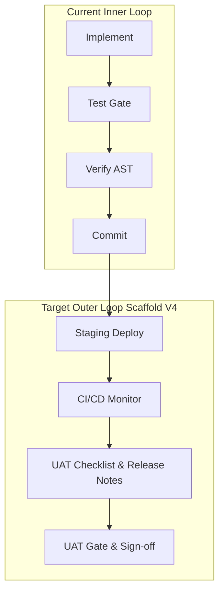

# 🚀 AI SDLC Harness Improvement Analysis & Strategic Roadmap

This document provides a comprehensive, high-fidelity strategic analysis of the outstanding harness engineering backlog and architectural roadmap. It consolidates and prioritizes the requirements from two core planning sources:
1. [AISDLC_HARNESS_BACKLOG.md](file:///c:/projects/Gym_App/docs/planning/AISDLC_HARNESS_BACKLOG.md) (Tier 1–3 Framework Evolution)
2. [RFC-002-outer-loop-delivery.md](file:///c:/projects/Gym_App/docs/planning/RFC-002-outer-loop-delivery.md) (Scaffold V4: Outer Loop Delivery Orchestration)

---

## 1. Executive Summary & Vision

The core mission is to transition the current **Agent Harness** from a *project-coupled inner loop execution gate* into a **portable, enterprise-ready outer loop orchestration engine**.

Rather than treating the harness as a static collection of check-scripts and passive configurations, this blueprint maps out a learning, self-improving, and highly optimized environment. By shifting from unstructured logs to a structured SQLite index, incorporating PageRank repository maps, and layering memory buffers, we establish a robust framework capable of driving 100% consistent local delivery.

---

## 2. The Four Synergistic Chains

A major risk of backlog evolution is "isolated feature drift"—building individual tools that add complexity without compounding value. To prevent this, the backlog is structured around **four core synergy chains** where items directly amplify one another.

### A. The Structural Understanding Chain
> **T1-H-01 (Repo Map) ➔ T1-H-02 (ADR Annotations) ➔ T1-G-01 (Routing) ➔ T1-G-03 (Typed Verdict)**

*   **How it works**: The PageRank repo map (`T1-H-01`) identifies structurally critical files. The ADR annotations (`T1-H-02`) tell the gate *why* decisions were made regarding those files. The diff-aware routing engine (`T1-G-01`) filters and selects which check suites actually matter for the active diff. Finally, the typed review verdict (`T1-G-03`) records structured metadata of the gate's findings for local persistence.
*   **The Synergy**: A review gate with all four items active doesn't just run static linting; it reviews active code diffs against the structural context of the codebase and the architectural intent behind the modified code, producing highly accurate, context-aware reviews.

### B. The Self-Improvement Loop
> **T1-D-00 (Skill Ownership Map) ➔ T1-C-01 (Outcome Inference) ➔ T1-I-03 (Outcome Tagging) ➔ T1-D-03 (Dream Phase + Contradiction Check)**

*   **How it works**: A `skill_ownership.yaml` routing map (`T1-D-00`) seeds five skills with the keyword/event/check-type patterns that link recurring failures to actionable skill files — a pure YAML config with no code dependencies, prerequisite to all downstream chain items. Retrospective outcome inference (`T1-C-01`) runs at every session start via `init_session.py`, classifying the prior session as `success`, `partial`, `abandoned`, or `escalated` from objective signals (HALT file, commits, open tasks, FAIL review verdicts), storing a three-field outcome record `{outcome, outcome_source, outcome_note}`. This is **fully agent-agnostic** — it works on Claude Code, Gemini/GymBase, Codex, Cursor, and open-source agents equally; the Claude Code Stop hook is an optional enhancement layer that writes `outcome_source: "hook"` but is not required for chain operation. A post-commit heartbeat (pre-commit framework `post-commit` stage) provides a true agent-agnostic activity signal. Outcome-aware startup orientation (`T1-I-03`) uses the outcome record to prime the new session's attention. The dream phase compiler (`T1-D-03`) runs at session start when data thresholds are met (≥10 sessions, ≥14 days span, 7-day cooldown), distilling patterns from `harness_events.jsonl` and `.ai-review-log.jsonl` into skill diff proposals. A critical-severity OR-branch bypasses frequency thresholds so rare-but-critical events always generate proposals. Contradiction detection is integrated into the same pass (`T1-I-05`), producing `__contradiction.md` cards that are never auto-archived.
*   **The Synergy**: Individually, hooks are just logging, and the dream phase is a speculative compiler. Together — with routing, platform-agnostic inference, session-start scheduling, and integrated contradiction checks — they form a **complete, closed-loop self-improvement flywheel** operable across all agent platforms without modifying core chain logic.

### C. The Portability Chain ✅ Complete (T1-A-01 through T1-A-07, main branch 2026-05-21)
> **T1-A-01 (Standalone Repo) ➔ T1-A-02 (Install Script) ➔ T1-A-04 (Config Checks) ➔ T1-A-05 (Split Context) ➔ T1-H-04 (Auto-Context Setup)**

*   **How it works**: Separating the generic framework from Gym App into a standalone repository (`T1-A-01`) is backed by a `bootstrap/install.py` script (`T1-A-02`). Declarative AST boundaries in `.agent/config.yaml` (`T1-A-04`) allow language-agnostic layers, while split universal/project context profiles (`T1-A-05`) remove configuration drift. The install-time generator (`T1-H-04`) bootstraps the project's context dynamically from structural facts rather than manual authoring.
*   **The Synergy**: These items solve the "blank-page onboarding" problem, reducing setup time from days to under 10 minutes, making the framework immediately usable in any repository or tech stack.
*   **Delivered**: T1-A-01 through T1-A-07 shipped across 7 PRs on the `feat/framework-t1-a0*` branch series. The framework can now be installed on any project in under 10 minutes, governs its own development on a feature branch, has a public repository, and produces clean tool supplements (CLAUDE.md, GEMINI.md, .cursorrules) pointing at a single `.agent/UNIVERSAL_CONTEXT.md` canonical source. T1-H-04 (auto-context from repo map) remains deferred pending T1-H-01 (PageRank map).

### D. The Efficient Memory Chain ✅ Complete (PR #125)
> **T1-I-00a (Staleness Foundation) ➔ T1-I-04 (Staleness Detection) ➔ T1-I-01 (Memory Tiering) ➔ T1-I-06 (Retention Policy)**

*   **How it works**: The staleness foundation (`T1-I-00a`) establishes the schema and base classes. Automated staleness checks (`T1-I-04`) use AST scanners to ensure that memory invariants match current codebase reality. Hot/warm/cold memory tiering (`T1-I-01`) ensures that only relevant files and recent ledger records are loaded during session startup, preventing token bloat. Retention policies (`T1-I-06`) keep local history compliant and lightweight, including `dream_proposals/` archival. Note: `T1-D-01` (SQLite state indexing) was deferred by CONSTRAINT-01 — queryable persistence requires a separate design decision on storage strategy.
*   **The Synergy**: Resolves the context-window bloating problem, maintaining high agent retrieval accuracy while keeping session startup times lightning fast.

---

## 3. Strategic Tensions & Design Invariants

Imposing constraints on autonomous agents requires balancing structural security against operational efficiency. We have established three strict design invariants to manage these tensions:

### I. The Context Injection Ceiling (Token Budget Constraint)
*   **The Problem**: Combining PageRank graphs, historical co-change warnings, active git diffs, and architectural rules can easily consume 4,000+ tokens before the agent reads the user's prompt, leading to "Lost in the Middle" reasoning degradation.
*   **The Invariant**: Enforce a **hard context budget cap of 2,000 tokens** for all injected metadata. The assembler must dynamically distribute token slots and use PageRank scores to aggressively truncate low-relevance structural data first.

### II. Dynamic Agency over Imperative Over-Specification
*   **The Problem**: Restricting agents with highly rigid, sequential workflow scripts turns a dynamic reasoning model into a brittle scripted automation. When tools drift or environments vary, the rigid system breaks.
*   **The Invariant**: The harness must enforce **Outcomes and Invariants** (e.g., "Branch isolation must not be violated," "Test suite must pass cleanly") but must *never* hardcode **Imperative Execution Mechanics** (the specific file paths, temporary script names, or implementation strategies the agent chooses to solve the problem).

### III. Gate Teaching over Frictional Blocking
*   **The Problem**: Gates that block developers or agents without providing explanation create high friction, forcing users to bypass them (e.g., via `--no-verify`).
*   **The Invariant**: Every automated check that fires a failure must be accompanied by **Policy Notes** (explaining the rationale behind the rule) and structured guidance on how to resolve the violation.

---

## 4. Confidence Tiers & Prioritization

To prevent backlog bloat (currently at 48 Tier 1 items), the roadmap is grouped into three distinct execution tiers:

1.  **High Confidence / High Value (Implement First)**:
    *   `T1-D-00` (Skill ownership map), `T1-C-01` (Outcome inference — platform-agnostic), `T1-H-01` (PageRank repo mapping), `T1-H-02` (ADR annotation checks), `T1-G-01` (Diff-aware routing), `T1-G-02` (Pre-flight shortcuts), `T1-A-04` (YAML config-driven checks), and `T1-A-05` (Two-layer context profiles). These provide immediate, measurable returns.
2.  **Medium Confidence / Medium Value (Implement Second)**:
    *   `T1-D-03` (Dream phase compiler — specced, queued after T1-C-01 data accumulation), `T1-H-03` (Co-change estimation), and `T1-E-01/02` (Tool/LLM ABC formalization). `T1-I-04` (Staleness detection) is now complete. These depend on having a steady flow of local historical data from the first tier.
3.  **Low Confidence / Uncertain Value (Implement Only on Demand)**:
    *   `T1-G-05` (Process sandboxing) and certain `T1-I` long-term retention archives. These are highly sophisticated but offer diminishing returns for solo developers or small teams.

---

## 5. Implementation Status & Next Steps

### Chain D — Efficient Memory Chain (Complete ✅)

Delivered in PR #125, merged to `devops` 2026-05-18:

| Target ID | Core Feature | Status |
|-----------|--------------|--------|
| **T1-I-00a** | **Staleness Foundation** (schema, base classes) | ✅ Complete |
| **T1-I-04** | **Staleness Detection** (AST + frontmatter scanner) | ✅ Complete |
| **T1-I-01** | **Memory Tiering** (hot/warm/cold loader) | ✅ Complete |
| **T1-I-06** | **Retention Policy** (archiver, `dream_proposals/` cleanup) | ✅ Complete |

Note: `T1-D-01` (SQLite state indexing) was deferred by CONSTRAINT-01 — SQLite is in `.gitignore`; queryable state requires a design decision on persistence strategy before implementation.

### Chain A — Portability Chain (Complete ✅)

Delivered across 7 PRs merged to `main` by 2026-05-21:

| Target ID | Core Feature | Status |
|-----------|--------------|--------|
| **T1-A-01** | **Standalone harness repository** | ✅ Complete |
| **T1-A-02** | **Bootstrap install script** (`bootstrap/install.py`) | ✅ Complete |
| **T1-A-03** | **Environment validation script** (`bootstrap/validate.py`) | ✅ Complete |
| **T1-A-04** | **Config-driven architecture checks** | ✅ Complete |
| **T1-A-05** | **Two-layer review_context.md** | ✅ Complete |
| **T1-A-06** | **Universal + stack-pack skills** | ✅ Complete |
| **T1-A-07** | **Tool supplement generation** (CLAUDE.md, GEMINI.md, .cursorrules shims) | ✅ Complete |

The framework now installs on any project in under 10 minutes, governs its own development on a feature branch, has a public repository at https://github.com/Peadarpol/ai-delivery-control, and produces clean tool supplements pointing at `.agent/UNIVERSAL_CONTEXT.md` as the single canonical context source. T1-H-04 (auto-context from repo map) remains deferred pending T1-H-01.

### Chain B — Self-Improvement Loop (Specced, pending implementation)

Full spec committed to `AISDLC_HARNESS_BACKLOG.md` on `fix/sqlite-reference-cleanup` branch. Implementation sequence:

| Target ID | Core Feature | Expected Effort | Dependencies | Status |
|-----------|--------------|-----------------|--------------|--------|
| **T1-D-00** | **Skill Ownership Map** (`skill_ownership.yaml`) | Very Low | None | 📅 Next Up |
| **T1-C-01** | **Outcome Inference + Post-commit Heartbeat** | Medium | T1-D-00 | 📅 Next Up |
| **T1-I-03** | **Outcome-Aware Startup Orientation** | Low | T1-C-01 | 📅 Queued |
| **T1-D-03** | **Dream Phase Compiler** (`distill_dream.py`, `maybe_run_dream_phase()`) | High | T1-D-00, T1-C-01, T1-I-03 | 📅 Queued |

Chain B requires ≥10 sessions of data before the dream phase fires. T1-D-00 and T1-C-01 begin accumulating that data immediately on implementation.

### Other Chains (Backlog)

| Chain | Key Items | Status |
|-------|-----------|--------|
| **C — Structural Understanding** | T1-H-01 (PageRank map), T1-H-02 (ADR annotations), T1-G-01 (diff routing), T1-G-03 (typed verdict) | 📅 Deferred post-Chain B |
